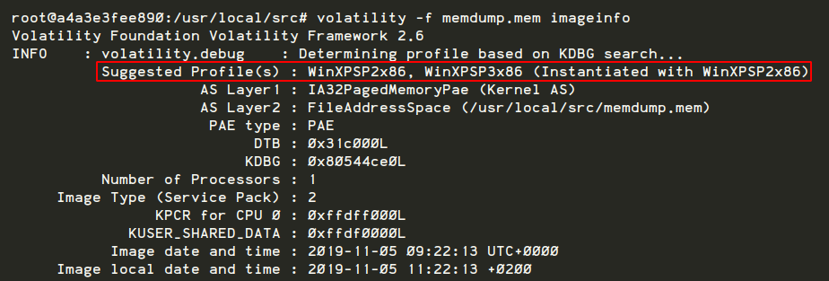
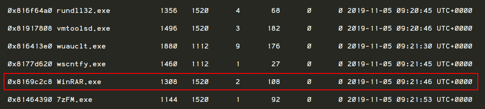
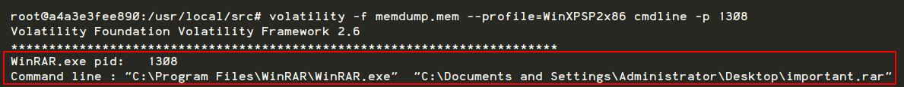
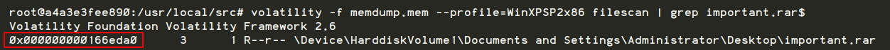
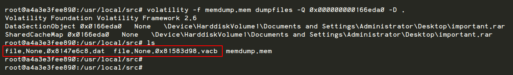
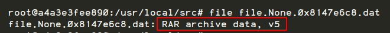
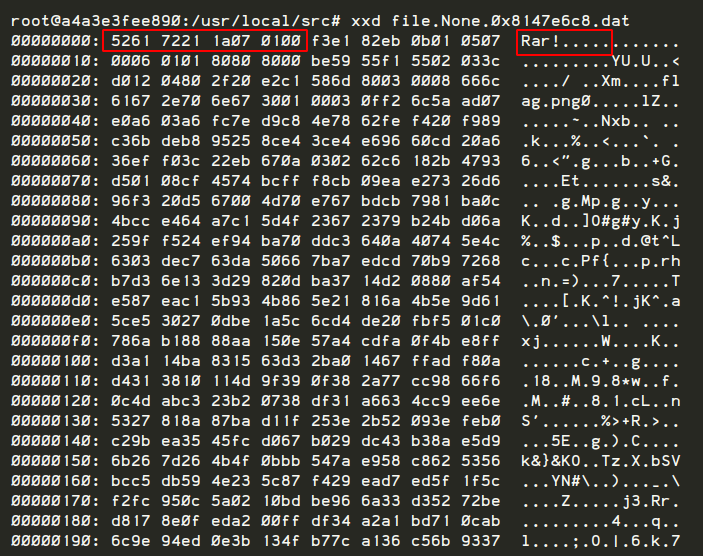
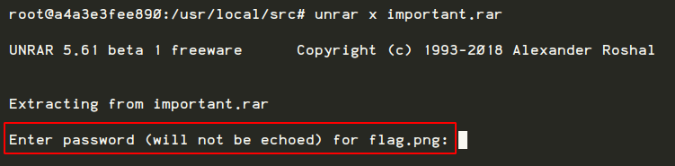
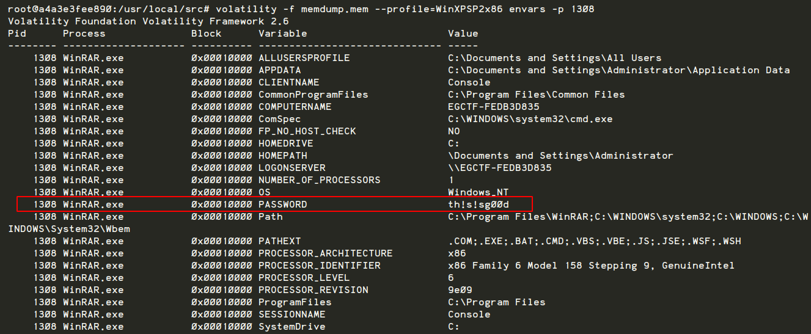
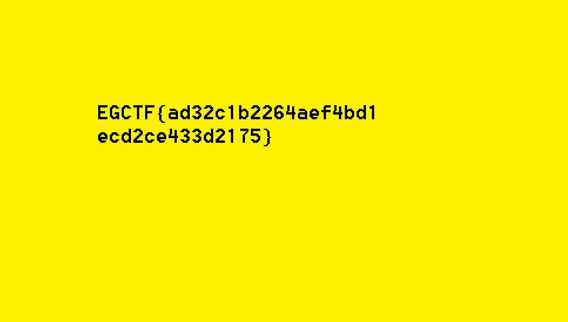

# Data Leakage, Forensics
---


## Introduction

This is my first write-up that I wanted to document how I solved a forensics challenge during EG-CTF.

**EG-CTF** is Egypt's first official national cybersecurity Capture The Flag (CTF) competition organized by EG-CERT.

The challenge named "Data Leakage" which we have to solve by analyzing a given memory dump file.

**What is a memory dump file?**

In Digital Forensics when you have the ability to do a live analysis (when the machine is still running) one of the necessary things that you need to do is to acquire the volatile data like the system memory which might be helpful when need to figure out what was happening during an incident.

Let’s get started!

## Problem

We acquired this memory image from the computer of the main suspect in  the corporate espionage case. Could you help us find what had been leaked?

**Memory Image name**: memdump.mem

## Solution

We will use **volatility** to analyze the memory dump.

Let's start by defining the image information we will use

```
volatility -f memdump.mem imageinfo
```

- **-f**: The path of the memory dump file path
- **imageinfo**: The plugin that we will use to identify the image information

We get back the following result showing that **WinXPSP2x86** and **WinXPSP3x86** are the suggested profiles that can be used for the rest of our analysis process by passing **--profile=WinXPSP2x86**.



Let's use another plugin called **pslist** that will help us to get a list of all processes that were running when we dumped the memory.

```
volatility -f memdump.mem --profile=WinXPSP2x86 pslist
```

While reviewing the result we notice **WinRAR.exe** process that looks interesting



So let's take a step forward by doing more investigation about this process by displaying the rest of the process's command-line argument using **cmdline**

```
volatility -f memdump.mem --profile=WinXPSP2x86 cmdline -p 1308
```
Note that we have passed the PID **1308** which related to our **WinRAR.exe** process. We get back the following result showing that this file **C:\Documents and Settings\Administrator\Desktop\important.rar** was used by the **WinRAR.exe** which looks important as it says xD



Now we need to retrieve the RAR file from the memory dump. First, let's identify the offset value of **important.rar** file in the memory using **filescan** plugin

```
volatility -f memdump.mem --profile=WinXPSP2x86 filescan | grep important.rar$
```

We get back the following result which contains the offset value **0x000000000166eda0** that can be used to access the content of that location in memory



Next, we will use **dumpfiles** to retrieve **important.rar**
```
volatility -f memdump.mem dumpfiles -Q 0x000000000166eda0 -D .
```
- **-Q**: Gives us the ability to access the content of a specific physical address in memory in order to dump it
- **-D**: The path of the dumped file(s)

As we can see the result introduced two files:
-  **file.None.0x8147e6c8.dat**: A *DataSectionObject* which points to the file in memory
- **file.None.0x81583d98.vacb**: A *SharedCacheMap* which points to the file cached by Windows Cache Manager



In order to check the file type we have can follow one of the following ways:

```
file file.None.0x8147e6c8.dat
```
This result of **file** command tell us that the file type is RAR as shown below



```
xxd file.None.0x8147e6c8.dat
```
The result of **xxd** command tell us that the file type is RAR as the file signature is **5261 7221 1a07 0100** which is the expected signature for RAR archive version 5.0 onwards



So now after retrieving the file from the memory and verified its type we can simply rename **file.None.0x8147e6c8.dat** to **important.rar** using this command
```
mv file.None.0x8147e6c8.dat important.rar
```

Next, we can use **unrar** to extract the file

```
unrar x important.rar
```
But as we try to became a step closer to the flag we have found out that we need a password to extract it



Let's go back to **volatility** and use **envars** plugin to display **WinRAR.exe** prcoess's environment variable
```
volatility -f memdump.mem --profile=WinXPSP2x86 envars -p 1308
```


*Voila!* We have found an environment variable called **PASSWORD** with the value **th!s!sg00d**. When we try this password during the RAR file extraction it will work as expected and we now we got our **flag.png**



Flag: EGCTF{ad32c1b2264aef4bd1ecd2ce433d2175}


